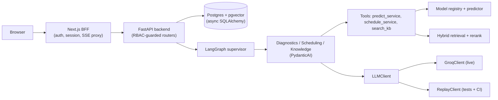

# PitCrew

PitCrew is a fleet maintenance copilot.
It predicts when each vehicle needs service, and lets a user ask a multi-agent assistant about any vehicle, its schedule, and maintenance knowledge, with cited answers.
It is a full-stack AI/LLM engineering portfolio project: async Postgres persistence, JWT auth with RBAC, a LangGraph supervisor routing to PydanticAI specialists, hybrid RAG with citations, evaluations wired into CI, and observability via Langfuse.

[](https://github.com/SK3737/Vehicle-Maintenance/actions/workflows/ci.yml)

> **Status: not yet deployed.**
> Every subsystem below (auth, agents, RAG, evals, CI) runs and is tested locally today.
> The live Neon/Render/Vercel/Langfuse Cloud deploy has not happened yet - no live URL and no real trace screenshot exist.
> See the [deployment checklist](#deployment-checklist) for exactly what is pending and why.

## Live demo

<!-- TODO: paste the live Vercel URL here after the Render + Vercel deploy in the deployment checklist below. -->

Not yet deployed.
The infrastructure-as-code (`render.yaml`, `frontend/vercel.json`, `.github/workflows/deploy.yml`) is written, and the exact backend Docker image was built and run locally end to end (`docker build` + `docker run` + `curl /health`), but no Render, Vercel, or Neon account exists yet.
See [ADR 0004](docs/adr/0004-deploy-stack-neon-render-vercel.md) and the [deployment checklist](#deployment-checklist).

## Architecture



Full component-by-component diagram and description: [`docs/architecture.md`](docs/architecture.md).
Design decisions and their tradeoffs: [`docs/adr/`](docs/adr/).
The story of what was built, why, and what is honestly still open: [`docs/case-study.md`](docs/case-study.md).

## Eval scores

`make eval` runs two complementary, independently-scored suites, wired into CI as a required gate (`.github/workflows/ci.yml`).
These are real numbers from a genuine run of the scoring code, judged via hand-synthesized cassettes under `LLM_BACKEND=replay` (deterministic, offline, reproduced byte-for-byte across multiple runs) - not a live-Groq-judged run, and not placeholder figures.
See [`.superpowers/sdd/task-9-report.md`](.superpowers/sdd/task-9-report.md) for exactly how they were produced.

**Ragas** (retrieval and answer quality, 3 cases, one deliberately imperfect per axis):

| Metric | Mean score | Threshold |
|---|---|---|
| Faithfulness | 0.9167 | 0.70 |
| Answer relevancy | 0.9319 | 0.70 |
| Context precision | 0.8333 | 0.60 |
| Context recall | 0.9167 | 0.70 |

**DeepEval** (agent trajectory and tool-selection correctness, 2 scenarios):

| Metric | Score |
|---|---|
| Trajectory / route correctness | 1.0000 |
| Tool-selection correctness | 1.0000 |

A future manual run against a live Groq judge, on a larger question set, is expected to produce broadly similar but not necessarily identical scores - see [`docs/case-study.md`](docs/case-study.md#tradeoffs-and-whats-actually-still-open).

## Agent trace / observability

<!-- TODO: paste an annotated Langfuse trace screenshot here once a real Langfuse Cloud account exists and one real assistant run has been traced. -->

Not yet available.
`backend/app/observability/langfuse.py` wraps every LangGraph supervisor node in a trace span, correlated to the UI by `run_id`, and is unit-tested to fail open in every failure mode (blank credentials, a broken client at construction time, a broken client at span-start time) - confirmed via the real golden diagnostics scenario producing an identical answer whether tracing is healthy, broken, or absent.
No Langfuse Cloud account exists yet, so no real trace has been captured.
Once one exists, this section gets a real annotated screenshot, not a mock-up.

## Tech stack

- **Backend**: FastAPI, SQLAlchemy 2.0 (async) + asyncpg, Alembic, Postgres + pgvector, PyJWT, argon2-cffi
- **Agents**: LangGraph (supervisor), PydanticAI (specialists), Groq (`llama-3.3-70b-versatile`, live) / cassette replay (tests + CI)
- **RAG**: pgvector cosine + Postgres full-text, Reciprocal Rank Fusion, local CPU cross-encoder rerank, local CPU sentence-transformer embeddings
- **Evals**: Ragas, DeepEval
- **Observability**: Langfuse
- **Frontend**: Next.js (App Router), TypeScript, Tailwind, shadcn/ui
- **Testing**: pytest + httpx (backend), Playwright (frontend e2e)
- **CI/CD**: GitHub Actions

## No paid API note

No paid LLM API (Anthropic or otherwise) is ever called anywhere in this codebase.
Live chat completions run on Groq's free tier.
Embeddings and reranking run locally on CPU, in every environment, with no API call and no GPU.
Tests and CI run entirely against recorded cassettes (`LLM_BACKEND=replay`), so they never touch Groq's uptime or quota.
See [ADR 0005](docs/adr/0005-groq-free-tier-local-embeddings-rerank.md) for the full rationale and its rate-limit tradeoff.

## Local development quickstart

Requirements: Docker (for Postgres + pgvector), Python 3.13, Node 22, and a free [Groq API key](https://console.groq.com/keys) (no credit card, no GPU needed) if you want the assistant to run live rather than in replay mode.

```bash
# 1. Bring up Postgres + pgvector
docker compose up -d db

# 2. Backend
cd backend
pip install -r requirements.txt
python -m alembic upgrade head
# Set GROQ_API_KEY and LLM_BACKEND=groq in backend/.env for a live assistant,
# or leave LLM_BACKEND=replay (the default) to run entirely offline against
# the committed cassettes in backend/cassettes/.
uvicorn app.main:app --reload

# 3. Seed demo data (vehicles, a mechanic user, the knowledge-base corpus)
python -m scripts.import_json
python -m app.rag.ingest   # ingests backend/data/kb/*.md into kb_documents/kb_chunks

# 4. Frontend (separate terminal)
cd frontend
npm ci
npm run dev
```

Then visit `http://localhost:3000`, or the backend's interactive docs at `http://localhost:8000/docs`.

Run the backend test suite and the eval gate:

```bash
make test    # pytest, LLM_BACKEND=replay, no network
make eval    # Ragas + DeepEval, replay-mode judge cassettes
```

## Deployment checklist

Everything below is genuinely still pending - none of it has been attempted, simulated, or fabricated in this repository.

- [ ] Create a Neon Postgres project (with the pgvector extension) and run migrations + seed + KB ingest against it.
- [ ] Create a Render account, deploy the backend from `render.yaml` (Docker runtime), and set the real `DATABASE_URL` (Neon) and `GROQ_API_KEY` secrets.
- [ ] Create a Vercel account and deploy the frontend from `frontend/vercel.json`, pointed at the live Render backend URL.
- [ ] Create a Langfuse Cloud account, set `LANGFUSE_PUBLIC_KEY` / `LANGFUSE_SECRET_KEY` / `LANGFUSE_HOST` on the Render service, and capture one real annotated trace screenshot for the [agent trace section](#agent-trace--observability) above.
- [ ] Add `RENDER_DEPLOY_HOOK_URL`, `VERCEL_TOKEN`, `VERCEL_ORG_ID`, and `VERCEL_PROJECT_ID` as GitHub Actions secrets so `.github/workflows/deploy.yml` starts actually deploying on push to `main` (it currently no-ops safely without them).
- [ ] Paste the live URL into the [live demo section](#live-demo) above.
- [ ] Pin `torch`'s CPU-only wheel index in `backend/requirements.txt` before relying on Render's free-tier build/memory limits - see [ADR 0004](docs/adr/0004-deploy-stack-neon-render-vercel.md) for why this matters.

## Documentation

- [`docs/architecture.md`](docs/architecture.md) - full component diagram and description.
- [`docs/adr/`](docs/adr/) - architecture decision records (auth, agent framework, RAG design, deploy stack, LLM strategy).
- [`docs/case-study.md`](docs/case-study.md) - the problem, the design, and an honest accounting of tradeoffs and what's next.
- [`docs/superpowers/specs/2026-07-23-pitcrew-design.md`](docs/superpowers/specs/2026-07-23-pitcrew-design.md) - the original design specification.

## Project layout

```
pitcrew/
  backend/         FastAPI app, agents (LangGraph + PydanticAI), RAG, evals, migrations
  frontend/        Next.js 16 app (dashboard + assistant UI)
  docs/            architecture, ADRs, case study, original design spec
  docker-compose.yml   Postgres + pgvector, backend, frontend for local dev
```
