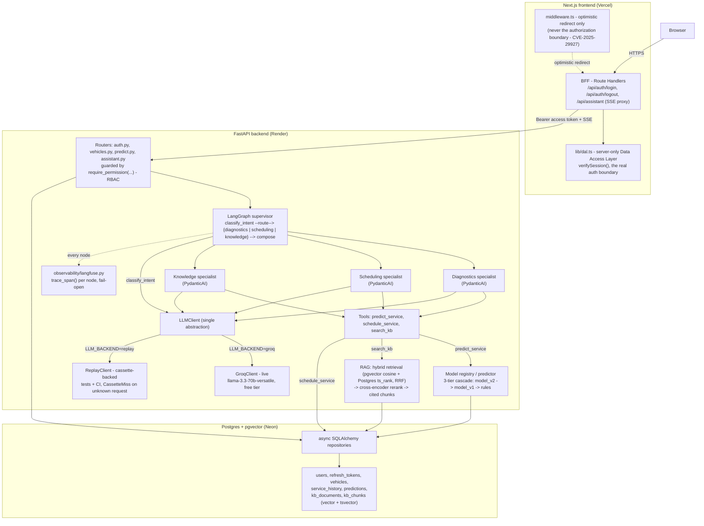

# Architecture

This document describes the system as actually built through Phase 9, verified against the code in `backend/app/` and `frontend/`, not reconstructed from the original plan alone.
See `docs/superpowers/specs/2026-07-23-pitcrew-design.md` for the original design rationale, and `docs/adr/` for the specific decisions and their tradeoffs.

## Data flow, end to end

## Components

**Browser** talks only to the Next.js frontend, never directly to the FastAPI backend.

**Next.js BFF (Backend-for-Frontend)**: Route Handlers under `frontend/app/api/` own login, logout, and the assistant's SSE proxy.
`frontend/lib/session.ts` holds a single HttpOnly `pitcrew_session` cookie containing both the backend's access and refresh tokens server-side; the browser never sees either token directly.
`frontend/middleware.ts` (`proxy.ts` layer) only checks cookie existence for an optimistic redirect - it is deliberately **not** the authorization boundary, because CVE-2025-29927 showed Next.js middleware can be bypassed.
The real boundary is `frontend/lib/dal.ts`'s `verifySession()`, called directly by server components (`dashboard/page.tsx`, `assistant/page.tsx`) with a `cache()`-memoized check, so the boundary holds even if middleware were deleted entirely.
The assistant's streaming route proxies Server-Sent Events using `fetch(...).body.getReader()` on the client, never `EventSource`, per the design spec's requirement.

**FastAPI backend**: four routers (`auth.py`, `vehicles.py`, `predict.py`, `assistant.py`), each route guarded by a `require_permission(...)` FastAPI dependency resolved against the role-to-permission map in `app/auth/rbac.py` (admin, mechanic, owner, demo).
`assistant.py` exposes both `POST /assistant/ask` (single JSON response) and `POST /assistant/stream` (SSE: `trace`, `token`, `sources`, `done`, `error` events, each carrying a `run_id`).

**LangGraph supervisor** (`app/agents/supervisor.py`): a compiled `StateGraph` - `classify_intent` routes to exactly one of `diagnostics`/`scheduling`/`knowledge`, each a **PydanticAI** agent with typed inputs, outputs, and tools, then `compose` finalizes the answer.
An iteration-budget guardrail runs at every node; a Groq `429` is caught at every node and degrades to a friendly message rather than a crash.
`/assistant/stream` drives the graph via `astream(stream_mode="updates")`, so the `trace` events the frontend renders are genuine per-node LangGraph output, not a simulated step list.

**Tools** (`app/agents/tools.py`): `predict_service` calls the model registry's 3-tier cascade (`model_v2` -> `model_v1` -> deterministic `rules`, whichever loads); `search_kb` calls the RAG hybrid-retrieval-then-rerank pipeline and returns typed `KBHit`s with `chunk_id`/`source`/`section`/`text`/`score`; `schedule_service` requires an explicit `confirmed=True` before any write, and currently persists to an in-memory stub (no `appointments` table exists yet - see the case study).

**RAG** (`app/rag/`): `retrieval.py` fuses a pgvector cosine-similarity ranking with a Postgres `tsvector`/`ts_rank` full-text ranking via Reciprocal Rank Fusion (`k=60`); `rerank.py` narrows the fused candidates with a local CPU cross-encoder.
Both embedding and reranking models run in-process on CPU, in every environment, with no API call and no GPU.

**LLMClient** (`app/agents/llm_client.py`): the one interface every chat/reasoning call in the codebase goes through.
`GroqClient` is the live implementation (`llama-3.3-70b-versatile`, reached when `LLM_BACKEND=groq`); `ReplayClient` is the deterministic, cassette-backed implementation (`LLM_BACKEND=replay`, the only backend the test suite and CI ever exercise), raising `CassetteMiss` on any unrecorded request rather than silently calling out.

**Observability** (`app/observability/langfuse.py`): `trace_span()` wraps each supervisor node.
Confirmed fail-open in both directions - blank credentials (this environment's actual state) and a broken/misconfigured Langfuse client both degrade to a no-op, verified by driving the real golden scenario through a force-broken client and confirming an identical answer.
A Langfuse outage or missing credentials can never break `/assistant/ask` or `/assistant/stream`.

**Persistence**: async SQLAlchemy 2.0 + asyncpg + Alembic migrations against Postgres with the `pgvector` extension (Neon in production, `pgvector/pgvector:pg16` locally via `docker-compose.yml`).
Core tables: `users`, `refresh_tokens`, `vehicles`, `service_history`, `predictions`, `kb_documents`, `kb_chunks` (with `vector(384)` and generated `tsvector` columns).

## What is not yet real

- No Neon, Render, Vercel, or Langfuse Cloud account exists as of this writing - `render.yaml`, `frontend/vercel.json`, and `.github/workflows/deploy.yml` are correct, inert infrastructure-as-code, verified locally (a real `docker build`/`docker run`/`curl /health` cycle against the exact backend image) but never deployed. See the README's [deployment checklist](../README.md#deployment-checklist).
- The scheduling specialist's booking write goes to an in-memory stub, not a persisted `appointments` table.
- The SSE `token` stream is word-chunked over the final composed answer after the fact, not true token-by-token model streaming - no `LLMClient` implementation in this codebase streams incrementally yet. The `trace` events in the same stream are genuine, real-time per-node LangGraph output.
